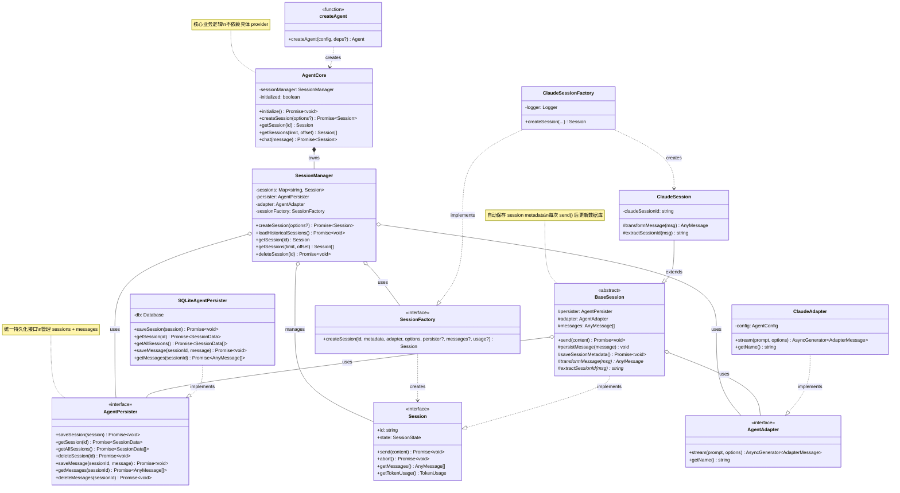

# Agent SDK Architecture

## Overview

Agent SDK 是一个 provider-agnostic 的 AI Agent 框架，通过依赖倒置原则支持多种 AI 提供商（Claude、OpenAI、Gemini 等）。

**核心设计原则**：

- **依赖倒置**：核心业务逻辑依赖接口而非具体实现
- **分层架构**：`api/` → `types/` → `core/` → `adapters/` + `persistence/`
- **统一持久化**：`AgentPersister` 统一管理 sessions 和 messages
- **会话先创建后对话**：Session 可以独立存在，不强制发送消息

---

## Architecture Diagram



---

## Key Components

### 1. API Layer (`api/`)

**createAgent(config, deps?)**

- 工厂函数，创建 Agent 实例
- 支持依赖注入（adapter, persister, sessionFactory）
- 默认使用 Claude + SQLite

```typescript
const agent = createAgent({
  workspace: "/path/to/workspace",
  model: "claude-sonnet-4",
});

await agent.initialize(); // 加载历史 sessions
```

---

### 2. Core Layer (`core/`)

#### AgentCore

- Agent 的核心实现
- 管理 SessionManager 生命周期
- 提供高层 API：`createSession()`, `chat()`, `getSessions()`

#### SessionManager

- 管理所有 Session 的生命周期
- **创建 Session**：生成 UUID，保存到数据库，创建内存对象
- **加载历史**：`loadHistoricalSessions()` 从数据库恢复所有 session
- 维护内存 Map：`sessions: Map<string, Session>`

#### BaseSession (Abstract)

- Session 的基础实现
- **关键功能**：
  - `send()`: 发送消息并流式接收回复
  - `persistMessage()`: 保存每条消息到数据库
  - `saveSessionMetadata()`: 每次对话后更新 session 元数据
- 子类实现：`transformMessage()`, `extractSessionId()`

---

### 3. Adapter Layer (`adapters/`)

**AgentAdapter** 接口：

- 将不同 AI provider 的 API 统一为 `stream()` 方法
- 返回标准化的 `AdapterMessage`

**ClaudeAdapter** 实现：

- 调用 `@anthropic-ai/claude-agent-sdk`
- 将 Claude 的消息格式转换为 `AdapterMessage`

**未来扩展**：

- `OpenAIAdapter`
- `GeminiAdapter`
- `CustomAdapter`

---

### 4. Persistence Layer (`persistence/`)

**AgentPersister** 接口：

- 统一管理 sessions 和 messages 的持久化
- **Session 操作**：`saveSession()`, `getSession()`, `getAllSessions()`, `deleteSession()`
- **Message 操作**：`saveMessage()`, `getMessages()`, `deleteMessages()`

**SQLiteAgentPersister** 实现：

- 使用 better-sqlite3 + Drizzle ORM
- 数据库位置：`<workspace>/.agentx/data/agent.db`
- 表结构：
  - `sessions`: id, summary, created_at, last_activity, cwd
  - `messages`: id, session_id, type, content, timestamp, (tool fields)

---

## Design Patterns

### 1. Dependency Inversion Principle (DIP)

```
High-level (AgentCore, SessionManager)
    ↓ depends on
Abstractions (AgentAdapter, AgentPersister, SessionFactory)
    ↑ implemented by
Low-level (ClaudeAdapter, SQLiteAgentPersister, ClaudeSessionFactory)
```

**好处**：

- 核心逻辑与 provider 解耦
- 易于测试（mock interfaces）
- 易于扩展（新增 OpenAI 只需实现接口）

---

### 2. Factory Pattern

**SessionFactory**：

- 封装 Session 的创建逻辑
- 不同 provider 有不同的 SessionFactory
- 支持传入历史消息和 token usage（用于从数据库恢复）

```typescript
sessionFactory.createSession(
  sessionId,
  metadata,
  adapter,
  options,
  persister, // 统一的 persister
  messages, // 历史消息
  tokenUsage // 历史 token 使用情况
);
```

---

### 3. Template Method Pattern

**BaseSession**：

- 定义 `send()` 的通用流程
- 子类实现特定步骤：
  - `transformMessage()`: 转换 provider 特定的消息格式
  - `extractSessionId()`: 提取 provider 的 session ID

---

## Data Flow

### Session Creation → Message Send → Persist

```
User
  ↓ createSession()
AgentCore
  ↓
SessionManager
  ↓ 1. Generate UUID
  ↓ 2. saveSession() to DB
  ↓ 3. createSession() via Factory
  ↓ 4. Add to Map
  ↓ Return Session
User
  ↓ session.send(message)
Session
  ↓ 1. persistMessage(userMsg) → DB
  ↓ 2. adapter.stream()
  ↓ 3. for each chunk
  ↓    - transformMessage()
  ↓    - persistMessage(agentMsg) → DB
  ↓ 4. saveSessionMetadata() → DB
```

---

## Session Lifecycle

```
[Created] ──send()──> [Active] ──complete──> [Idle]
    │                     │
    │                  abort()
    │                     │
    └─────delete()────> [Deleted]
```

**State 说明**：

- `created`: Session 刚创建，还未发送消息
- `active`: 正在发送消息或接收回复
- `idle`: 消息发送完成，等待下一次 send()
- `completed`: 手动标记完成
- `aborted`: 中止
- `deleted`: 已删除

---

## Persistence Strategy

### 何时保存？

1. **Session 创建时**：`SessionManager.createSession()` 立即保存到数据库
2. **每条消息时**：`BaseSession.persistMessage()` fire-and-forget 异步保存
3. **对话完成后**：`BaseSession.saveSessionMetadata()` 更新 lastActivity 和 summary

### 为什么分离 Session 和 Message？

- **Session**: 元数据，轻量级，频繁更新（lastActivity）
- **Message**: 内容，重量级，只增不改

### 数据库 Schema

```sql
-- sessions 表
CREATE TABLE sessions (
  id TEXT PRIMARY KEY,
  summary TEXT,
  created_at TEXT NOT NULL,
  last_activity TEXT NOT NULL,
  cwd TEXT
);

-- messages 表
CREATE TABLE messages (
  id TEXT PRIMARY KEY,
  session_id TEXT NOT NULL,
  type TEXT NOT NULL,        -- 'user' | 'agent' | 'tool' | 'system'
  content TEXT NOT NULL,     -- JSON: string | ContentBlock[]
  timestamp TEXT NOT NULL,
  is_tool_use INTEGER,
  tool_name TEXT,
  tool_input TEXT,
  tool_id TEXT,
  tool_result TEXT,
  FOREIGN KEY (session_id) REFERENCES sessions(id) ON DELETE CASCADE
);
```

---

## Extension Points

### 添加新的 AI Provider（如 OpenAI）

1. **实现 AgentAdapter**：

   ```typescript
   class OpenAIAdapter implements AgentAdapter {
     async *stream(prompt, options) {
       // 调用 OpenAI API，yield AdapterMessage
     }
   }
   ```

2. **实现 Session 子类**：

   ```typescript
   class OpenAISession extends BaseSession {
     transformMessage(msg) {
       /* 转换 OpenAI 消息 */
     }
     extractSessionId(msg) {
       /* 提取 OpenAI session ID */
     }
   }
   ```

3. **实现 SessionFactory**：

   ```typescript
   class OpenAISessionFactory implements SessionFactory {
     createSession(...) {
       return new OpenAISession(...);
     }
   }
   ```

4. **使用依赖注入**：
   ```typescript
   const agent = createAgent(
     { workspace: './project' },
     {
       adapter: new OpenAIAdapter(...),
       sessionFactory: new OpenAISessionFactory(...)
     }
   );
   ```

---

## Benefits of This Architecture

✅ **Provider Agnostic**: 核心逻辑与 AI provider 解耦
✅ **Testable**: 所有依赖都是接口，易于 mock
✅ **Extensible**: 新增 provider 只需实现接口
✅ **Persistence First**: Session 和 Message 自动持久化
✅ **Stateless Restart**: 重启后自动加载历史 sessions
✅ **Clear Separation**: 逻辑清晰（create ≠ send）
✅ **Unified Persister**: 一个接口管理所有数据
