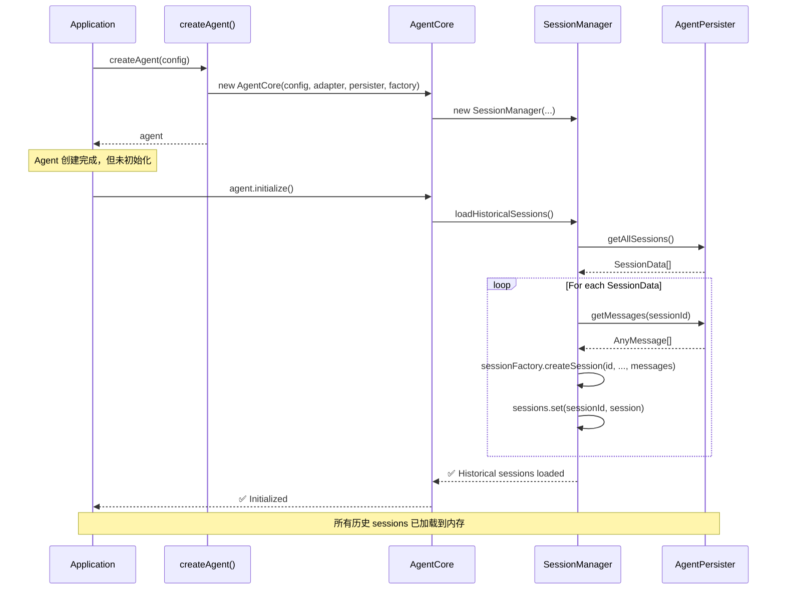
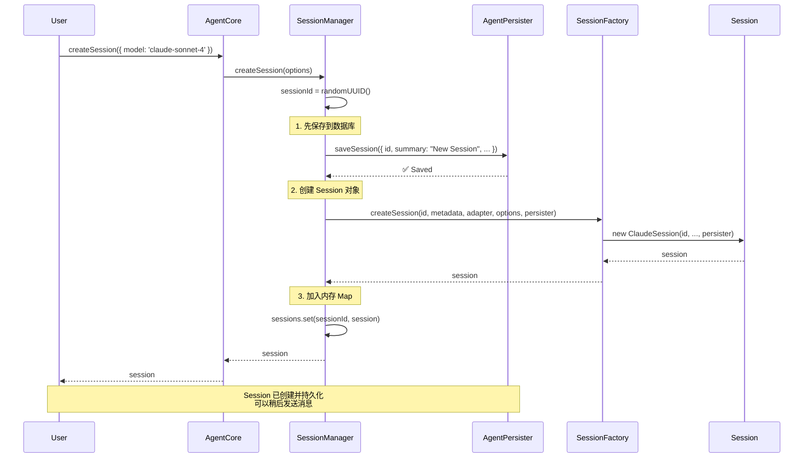
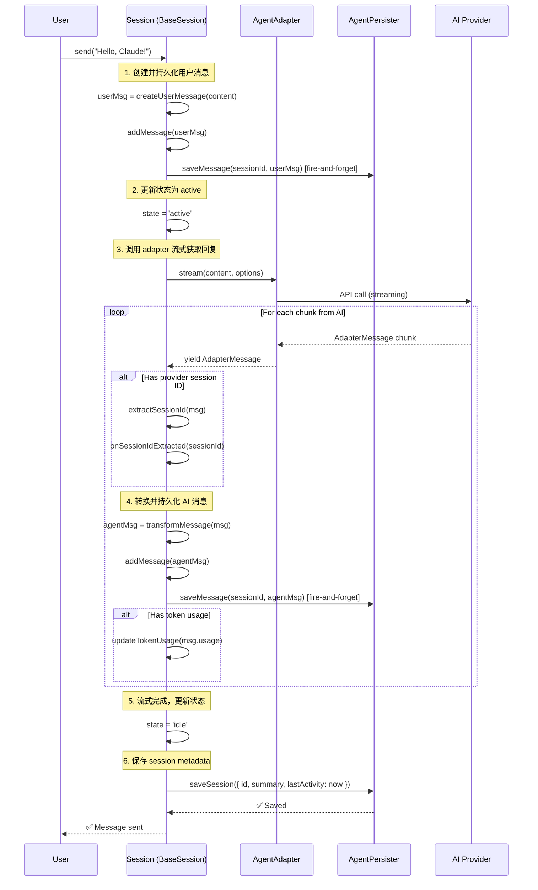
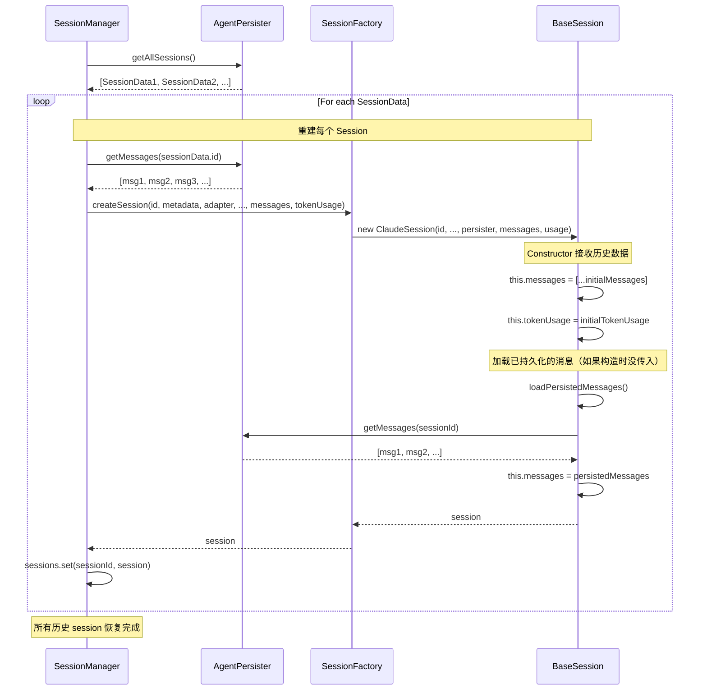
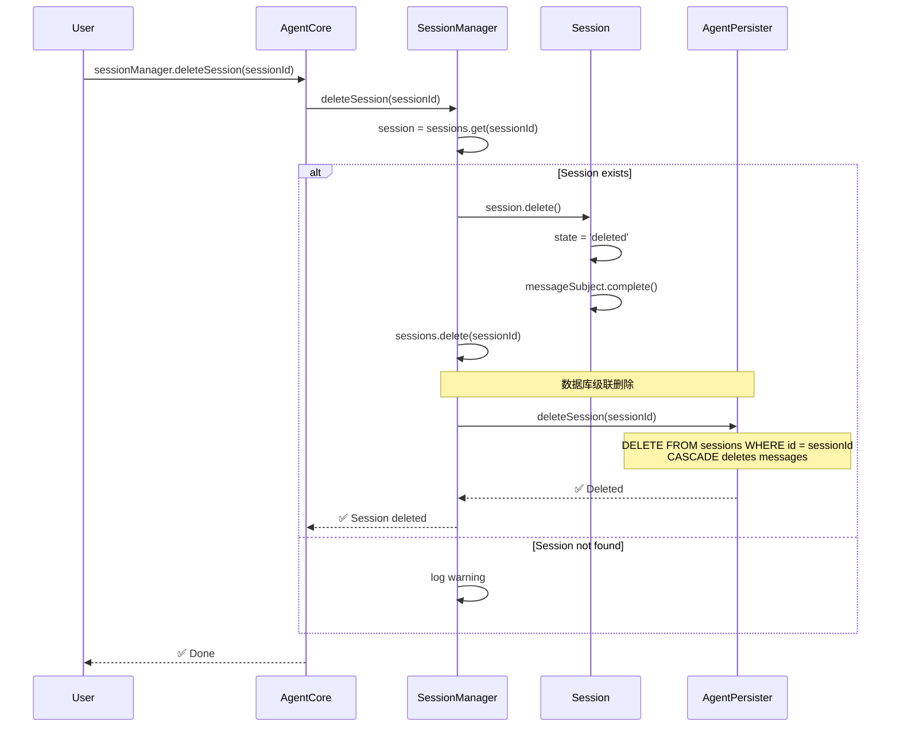
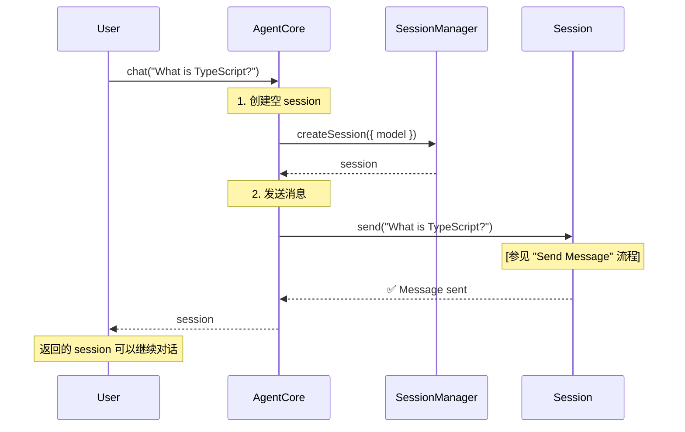
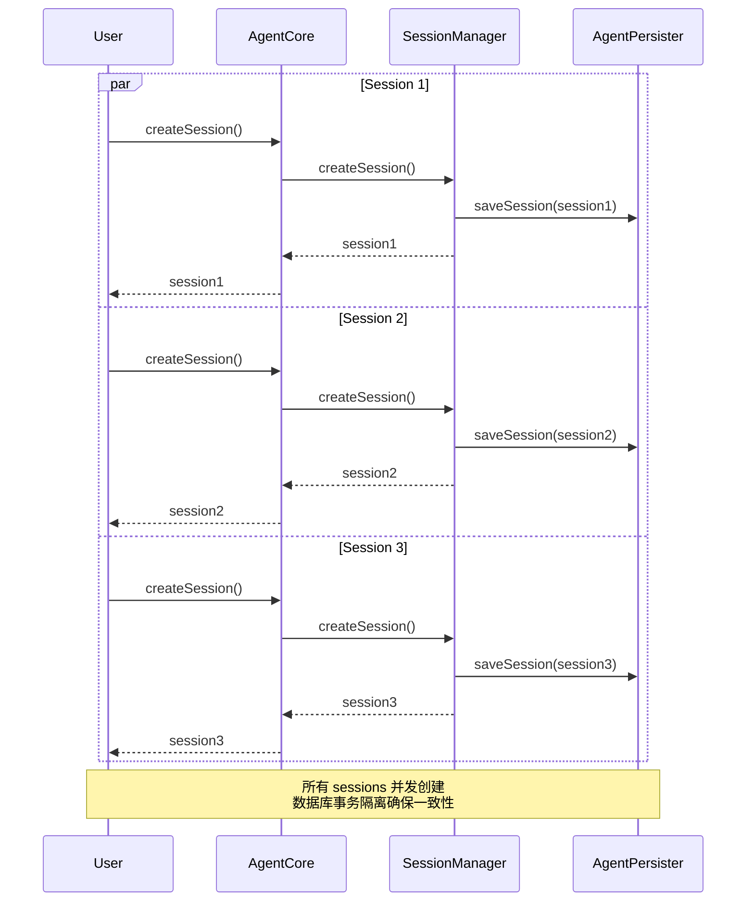
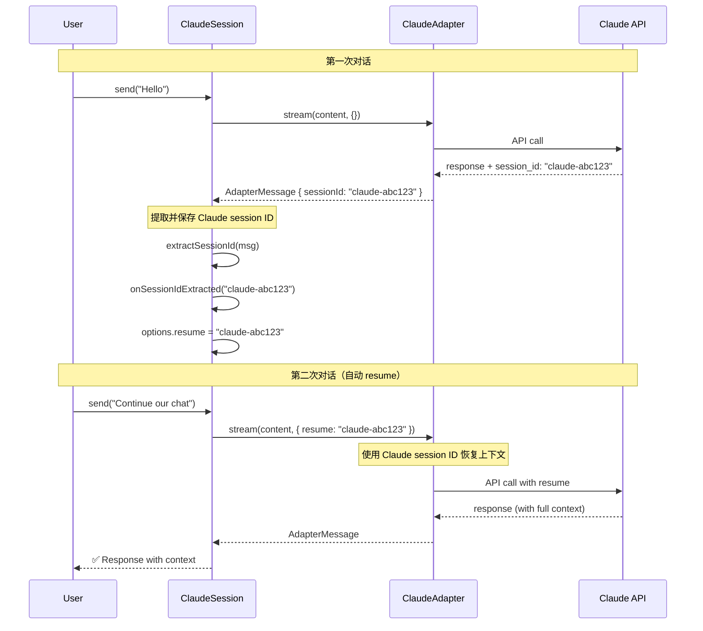
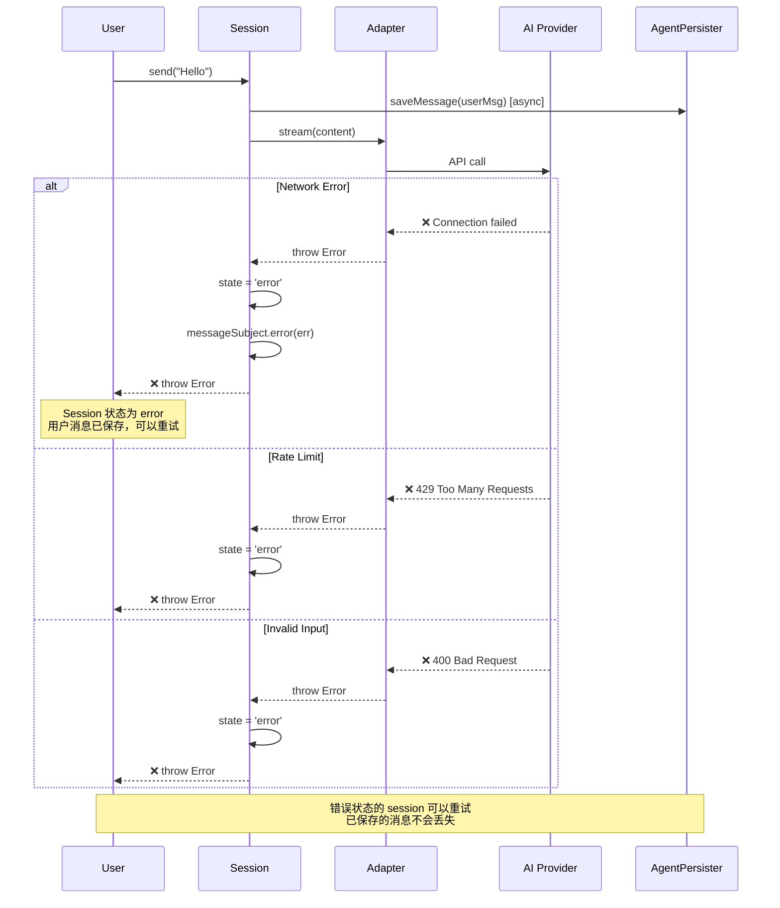
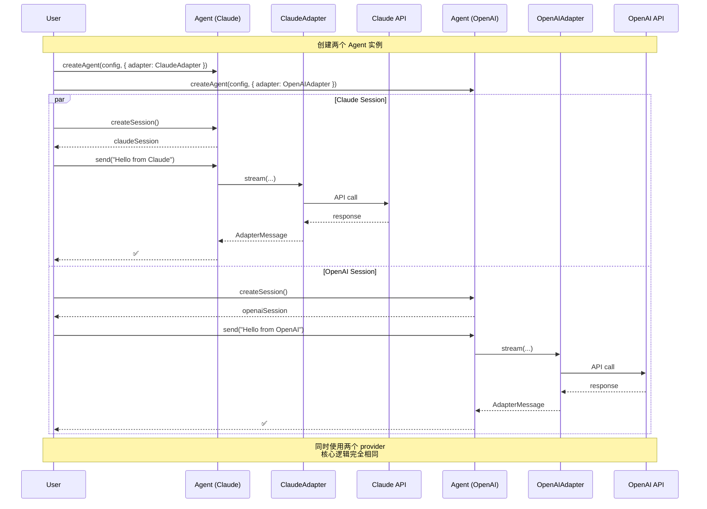

# Agent SDK Sequence Diagrams

本文档通过序列图展示 Agent SDK 的核心流程。

---

## 1. Agent Initialization（Agent 初始化）

**场景**：应用启动时，创建 Agent 并加载历史 sessions

**关键点**：

1. `createAgent()` 只创建实例，不执行 I/O
2. `initialize()` 才加载历史数据
3. 每个 session 的 messages 都被加载并传入 SessionFactory
4. Session 对象重建后加入内存 Map

---

## 2. Create Empty Session（创建空 Session）

**场景**：用户点击 "New Session"，创建一个空的会话容器

**关键点**：

1. 先保存 session metadata 到数据库（持久化优先）
2. 再创建内存对象
3. Session 没有消息，状态为 `created`
4. 用户可以稍后调用 `session.send()` 发送消息

---

## 3. Send Message（发送消息）

**场景**：向已存在的 session 发送消息并接收 AI 回复

**关键点**：

1. **Fire-and-forget**: 消息持久化不阻塞主流程
2. **流式处理**: 边接收边持久化，不等全部完成
3. **自动更新**: 对话完成后自动更新 session metadata
4. **Token 追踪**: 累积 token usage 统计

---

## 4. Load Historical Session（加载历史 Session）

**场景**：重启应用后，从数据库恢复 session

**关键点**：

1. `getAllSessions()` 获取所有 session 元数据
2. 为每个 session 加载其完整的 messages
3. 通过 SessionFactory 重建 Session 对象
4. Session 对象包含所有历史消息和 token usage
5. 加入内存 Map，用户可以继续对话

---

## 5. Delete Session（删除 Session）

**场景**：用户删除一个 session

**关键点**：

1. 先更新内存对象状态（`deleted`）
2. 从内存 Map 移除
3. 数据库级联删除（session + messages）
4. `ON DELETE CASCADE` 自动删除关联的 messages

---

## 6. Quick Chat（快速对话）

**场景**：一次性创建 session 并发送消息的便利方法

**关键点**：

1. `chat()` 是 `createSession()` + `send()` 的语法糖
2. 本质上是两步操作，不是原子操作
3. 返回的 session 可以继续使用

---

## 7. Concurrent Session Creation（并发创建 Sessions）

**场景**：同时创建多个 session（测试、批处理等）

**关键点**：

1. 每个 `createSession()` 独立执行
2. 数据库事务隔离保证数据一致性
3. 内存 Map 操作是线程安全的（JavaScript 单线程）

---

## 8. Session Resume（Session 恢复）

**场景**：使用 provider 的 session ID 恢复对话（如 Claude 的 resume 功能）

**关键点**：

1. **Provider Session ID**: Claude 等 provider 自己的 session ID
2. **自动提取**: `extractSessionId()` 从 AdapterMessage 提取
3. **自动注入**: 下次 `send()` 自动带上 resume 参数
4. **双层 ID**: 我们的 UUID + Provider 的 session ID

---

## 9. Error Handling（错误处理）

**场景**：发送消息时发生错误

**关键点**：

1. **用户消息已保存**: 即使失败，用户消息也已持久化
2. **状态标记**: Session 状态变为 `error`
3. **可重试**: 用户可以重新调用 `send()`
4. **不丢数据**: 数据库中的数据保持一致

---

## 10. Multi-Provider Scenario（多 Provider 场景）

**场景**：同时使用 Claude 和 OpenAI（假设）

**关键点**：

1. **接口统一**: 所有 provider 都实现 `AgentAdapter`
2. **逻辑复用**: AgentCore, SessionManager, BaseSession 完全复用
3. **依赖注入**: 通过 `createAgent()` 的 deps 参数切换 provider
4. **并行运行**: 可以同时使用多个 provider

---

## Summary

### 核心流程总结

1. **初始化**: `createAgent()` → `initialize()` → 加载历史 sessions
2. **创建会话**: `createSession()` → 保存到 DB → 创建内存对象
3. **发送消息**: `send()` → 持久化用户消息 → 流式接收 → 持久化 AI 消息 → 更新 metadata
4. **恢复会话**: 从 DB 加载 sessions + messages → 重建 Session 对象
5. **删除会话**: 更新状态 → 从内存删除 → 级联删除数据库

### 设计亮点

✅ **持久化优先**: 先保存数据库，再创建内存对象
✅ **异步持久化**: 消息保存不阻塞主流程（fire-and-forget）
✅ **自动更新**: 每次对话后自动更新 session metadata
✅ **状态恢复**: 重启后完整恢复所有 sessions
✅ **错误容错**: 错误发生时数据不丢失，可重试
✅ **Provider 无关**: 所有流程与具体 AI provider 解耦
