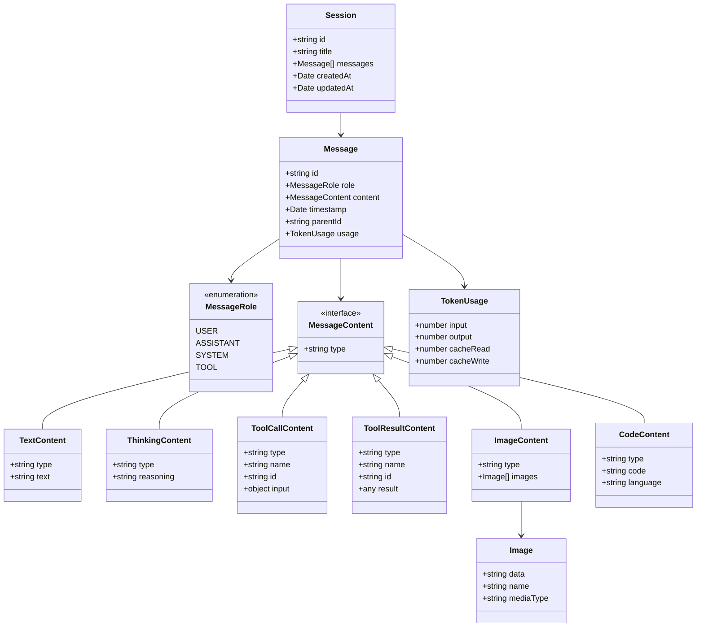

# Agent Types - Architecture Design (Simplified)

## Design Principles

**Occam's Razor**: Entities should not be multiplied beyond necessity.

**Single Responsibility**: Each type has exactly one reason to change.

**Minimalism**: Only define data structures, not runtime behavior.

---

## Overview

This package provides **minimal, focused type definitions** for the Deepractice Agent ecosystem. It contains only the essential data structures needed to represent messages and sessions.

### Scope

✅ **In Scope** (Data Structures):

- Message structure and content types
- Session container
- Token usage tracking

❌ **Out of Scope** (Runtime Behavior):

- Events (belongs in agent-sdk)
- State machines (belongs in agent-sdk)
- Agent configuration (belongs in agent-sdk)
- Error classes (use standard Error)
- Statistics computation (runtime concern)

---

## Core Type System



---

## Type Definitions

### Message System

```typescript
// ============================================================================
// Message
// ============================================================================

/**
 * Message - The fundamental unit of information
 *
 * A message represents a single piece of communication in the system.
 * It can come from users, AI, system, or tools.
 */
export interface Message {
  /** Unique identifier */
  id: string;

  /** Who sent this message */
  role: MessageRole;

  /** Message content (polymorphic) */
  content: MessageContent;

  /** When this message was created */
  timestamp: Date;

  /** Parent message ID for threading (optional) */
  parentId?: string;

  /** Token usage for AI messages (optional) */
  usage?: TokenUsage;
}

// ============================================================================
// Message Role
// ============================================================================

export type MessageRole =
  | "user" // Human user
  | "assistant" // AI assistant
  | "system" // System notification
  | "tool"; // Tool execution

// ============================================================================
// Message Content (Discriminated Union)
// ============================================================================

export type MessageContent =
  | TextContent
  | ThinkingContent
  | ToolCallContent
  | ToolResultContent
  | ImageContent
  | CodeContent;

// ============================================================================
// Content Types
// ============================================================================

/** Plain text or Markdown content */
export interface TextContent {
  type: "text";
  text: string;
}

/** AI reasoning/thinking process */
export interface ThinkingContent {
  type: "thinking";
  reasoning: string;
}

/** Tool invocation request */
export interface ToolCallContent {
  type: "tool-call";
  name: string;
  id: string;
  input: Record<string, unknown>;
}

/** Tool execution result */
export interface ToolResultContent {
  type: "tool-result";
  name: string;
  id: string;
  result: unknown;
}

/** Image attachments */
export interface ImageContent {
  type: "image";
  images: Image[];
}

export interface Image {
  data: string; // base64 or URL
  name: string;
  mediaType: "image/png" | "image/jpeg" | "image/gif" | "image/webp";
}

/** Code block */
export interface CodeContent {
  type: "code";
  code: string;
  language?: string;
}

// ============================================================================
// Token Usage
// ============================================================================

export interface TokenUsage {
  input: number;
  output: number;
  cacheRead?: number;
  cacheWrite?: number;
}
```

### Session System

```typescript
// ============================================================================
// Session
// ============================================================================

/**
 * Session - A conversation container
 *
 * A session is a collection of messages that belong to the same conversation.
 * It's a pure data structure with no behavior.
 */
export interface Session {
  /** Unique identifier */
  id: string;

  /** Session title */
  title: string;

  /** All messages in this session */
  messages: Message[];

  /** When this session was created */
  createdAt: Date;

  /** When this session was last updated */
  updatedAt: Date;
}
```

---

## Type Guards

```typescript
// ============================================================================
// Type Guards for MessageContent
// ============================================================================

export function isTextContent(content: MessageContent): content is TextContent {
  return content.type === "text";
}

export function isThinkingContent(content: MessageContent): content is ThinkingContent {
  return content.type === "thinking";
}

export function isToolCallContent(content: MessageContent): content is ToolCallContent {
  return content.type === "tool-call";
}

export function isToolResultContent(content: MessageContent): content is ToolResultContent {
  return content.type === "tool-result";
}

export function isImageContent(content: MessageContent): content is ImageContent {
  return content.type === "image";
}

export function isCodeContent(content: MessageContent): content is CodeContent {
  return content.type === "code";
}
```

---

## Design Decisions

### 1. Why No MessageMetadata?

**Original Design**:

```typescript
interface MessageMetadata {
  source?: MessageSource;
  status?: MessageStatus;
  parentId?: string;
  usage?: TokenUsage;
  customData?: Record<string, unknown>;
}
```

**Problem**: Violates Single Responsibility - contains 5 different concerns.

**Solution**: Fields promoted to Message directly, customData removed (YAGNI).

```typescript
interface Message {
  id: string;
  role: MessageRole;
  content: MessageContent;
  timestamp: Date;
  parentId?: string; // Direct field
  usage?: TokenUsage; // Direct field
}
```

### 2. Why No MessageSource?

**Original Design**:

```typescript
MessageRole = "user" | "assistant" | "system" | "tool";
MessageSource = "chat" | "shell" | "debugger" | "tool" | "system";
```

**Problem**: Overlapping concepts ("tool", "system" appear in both).

**Solution**: `role` is sufficient. If runtime needs to track source channel, it's a runtime concern, not a type concern.

### 3. Why No MessageStatus?

**Original Design**:

```typescript
MessageStatus = "pending" | "success" | "error";
```

**Problem**: Messages are immutable data. Status is a runtime state machine concern.

**Solution**: Removed. If SDK needs to track message processing status, it should be in a separate runtime state structure.

### 4. Why No Events in agent-types?

**Original Design**: AgentEvent, MessageEvent, SessionEvent, StreamEvent, etc.

**Problem**: Events are runtime behavior, not data structures.

**Solution**: Moved to agent-sdk. agent-types only defines data.

### 5. Why No Session.state?

**Original Design**:

```typescript
Session {
  state: SessionState; // "idle" | "active" | "thinking" | "error"
}
```

**Problem**: Session is a data container, not a state machine.

**Solution**: State management belongs in agent-sdk runtime, not in the data structure.

### 6. Why No SessionStatistics?

**Original Design**:

```typescript
SessionStatistics {
  messageCount: number;
  totalInputTokens: number;
  totalOutputTokens: number;
  ...
}
```

**Problem**: Statistics can be computed from messages at runtime.

**Solution**: Removed. Compute on-demand:

```typescript
const stats = computeSessionStats(session.messages);
```

### 7. Why No SystemContent/ErrorContent?

**Considered**:

```typescript
SystemContent { type: "system"; message: string; level: "info" | "warning" | "error" }
ErrorContent { type: "error"; error: string; stack?: string; }
```

**Decision**: Keep it simple - use `TextContent` with `role: "system"` for now.

**Rationale**:

- Can add later if needed (backward compatible)
- Most "system messages" are just text
- Errors can be represented as text or in separate error handling

---

## File Organization

```text
src/
├── message.ts     # Message + MessageRole + MessageContent + 6 content types + TokenUsage
├── session.ts     # Session
├── guards.ts      # Type guard functions
└── index.ts       # Public exports
```

**Total**: 4 files, ~200 lines of code.

---

## Comparison: Before vs After

| Aspect               | Original | Simplified | Change |
| -------------------- | -------- | ---------- | ------ |
| **Total Types**      | 30+      | 12         | -60%   |
| **Files**            | 7        | 4          | -43%   |
| **Enumerations**     | 10       | 1          | -90%   |
| **Nesting Levels**   | 4        | 2          | -50%   |
| **Lines of Code**    | ~500     | ~200       | -60%   |
| **SRP Violations**   | 5        | 0          | ✅     |
| **Concept Overlaps** | 4        | 0          | ✅     |

---

## Extension Strategy

### Adding New Content Types

```typescript
// Future: Add DiffContent
export interface DiffContent {
  type: "diff";
  oldCode: string;
  newCode: string;
  language?: string;
}

// Update union
export type MessageContent =
  | TextContent
  | ThinkingContent
  | ToolCallContent
  | ToolResultContent
  | ImageContent
  | CodeContent
  | DiffContent; // ← Added

// Add type guard
export function isDiffContent(content: MessageContent): content is DiffContent {
  return content.type === "diff";
}
```

### Adding Metadata (If Truly Needed)

```typescript
// If we discover we really need custom metadata:
export interface Message {
  id: string;
  role: MessageRole;
  content: MessageContent;
  timestamp: Date;
  parentId?: string;
  usage?: TokenUsage;
  metadata?: Record<string, unknown>; // ← Add as last resort
}
```

---

## Usage Examples

### Creating Messages

```typescript
// Text message from user
const userMessage: Message = {
  id: "msg-1",
  role: "user",
  content: {
    type: "text",
    text: "Hello, Agent!"
  },
  timestamp: new Date()
};

// AI response with thinking
const aiMessage: Message = {
  id: "msg-2",
  role: "assistant",
  content: {
    type: "thinking",
    reasoning: "User is greeting, should respond politely..."
  },
  timestamp: new Date(),
  usage: {
    input: 150,
    output: 80
  }
};

// Tool call
const toolCall: Message = {
  id: "msg-3",
  role: "assistant",
  content: {
    type: "tool-call",
    name: "search_web",
    id: "call-abc",
    input: { query: "latest news" }
  },
  timestamp: new Date()
};

// Tool result
const toolResult: Message = {
  id: "msg-4",
  role: "tool",
  content: {
    type: "tool-result",
    name: "search_web",
    id: "call-abc",
    result: { items: [...] }
  },
  timestamp: new Date(),
  parentId: "msg-3"  // Links to the tool call
};
```

### Creating Sessions

```typescript
const session: Session = {
  id: "session-1",
  title: "New Conversation",
  messages: [userMessage, aiMessage, toolCall, toolResult],
  createdAt: new Date("2024-01-14T10:00:00Z"),
  updatedAt: new Date("2024-01-14T10:05:00Z"),
};
```

### Type-Safe Content Handling

```typescript
function renderMessage(message: Message) {
  const { content } = message;

  if (isTextContent(content)) {
    return <MarkdownText>{content.text}</MarkdownText>;
  }

  if (isThinkingContent(content)) {
    return <ThinkingSection reasoning={content.reasoning} />;
  }

  if (isToolCallContent(content)) {
    return <ToolCallDisplay name={content.name} input={content.input} />;
  }

  if (isToolResultContent(content)) {
    return <ToolResultDisplay result={content.result} />;
  }

  if (isImageContent(content)) {
    return <ImageGallery images={content.images} />;
  }

  if (isCodeContent(content)) {
    return <CodeBlock code={content.code} language={content.language} />;
  }

  // TypeScript ensures exhaustive checking
  const _exhaustive: never = content;
  return null;
}
```

---

## Version Strategy

- **Major (1.0 → 2.0)**: Breaking changes to Message or Session structure
- **Minor (1.0 → 1.1)**: New content types, new optional fields
- **Patch (1.0.0 → 1.0.1)**: Documentation, type guards, bug fixes

---

## Migration from agent-sdk

1. Copy base types: `Message`, `Session`
2. Add new content types: `ImageContent`, `CodeContent`
3. Remove metadata wrapper - promote fields to Message
4. Remove event types (move to agent-sdk)
5. Remove state/config types (move to agent-sdk)
6. Add type guards in `guards.ts`

---

## Philosophy

> "Perfection is achieved, not when there is nothing more to add, but when there is nothing left to take away."
> — Antoine de Saint-Exupéry

This type system follows this principle:

- **Minimal** - Only essential data structures
- **Focused** - Clear separation: data (types) vs behavior (SDK)
- **Extensible** - Easy to add content types without breaking changes
- **Type-Safe** - Discriminated unions with exhaustive checking
- **Zero Dependencies** - Pure TypeScript types

---

## FAQ

### Q: Why no custom metadata field?

**A**: YAGNI (You Aren't Gonna Need It). We can add it later if we discover a real need. For now, the defined fields cover all known use cases.

### Q: What if I need to track message status?

**A**: That's runtime state, not data. Track it separately in your application:

```typescript
// In your app/SDK
const messageStates = new Map<string, "pending" | "success" | "error">();
messageStates.set(message.id, "pending");
```

### Q: What about session state (idle/active/thinking)?

**A**: Same answer - runtime state, not data. Managed by your state machine in agent-sdk.

### Q: Can I add more content types?

**A**: Yes! Just extend the `MessageContent` union and add a type guard. This is backward compatible.

### Q: What if I need to store computed statistics?

**A**: Compute them on-demand or cache them in your runtime layer. Don't pollute the pure data structure with derived data.
